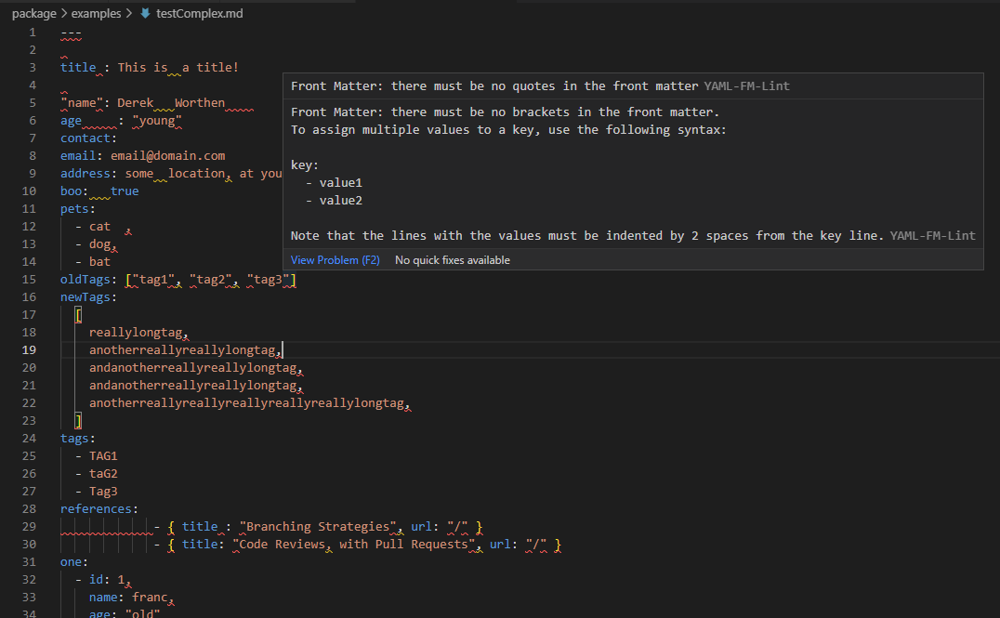

# yaml-fm-lint

---

This is the VS Code extension for real-time YAML front matter/metada linting in Markdown files.
The extension is using the [yaml-fm-lint](https://github.com/leneti/yaml-fm-lint) npm package to do the linting.

## Features

As with the main linting package itself, this extension is quick to install and configure. If there is a `.yaml-fm-lint.json` or `.yaml-fm-lint.js` configuration file in the directory of the linted file, the extension will use it.

---

## Known Issues

Feel free to leave feedback!

## Release Notes

You can see the full change log in the [CHANGELOG.md](CHANGELOG.md) file.
